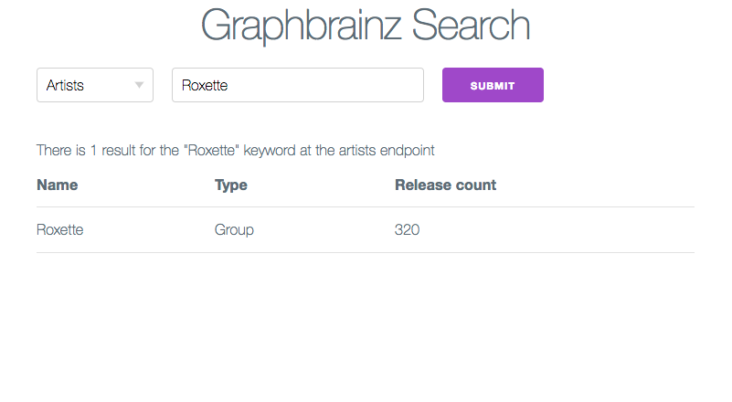
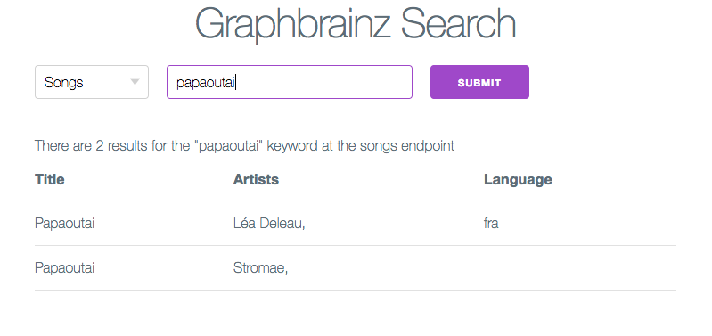

# Graphbrainz Client

This is an experimental project in order to try GraphQL with Apollo and React.

Search for songs by title or artists by name in the [Musicbrainz](http://musicbrainz.org/) database.

## Screenshots

* Search for artist

* Search for song


## Stack

* [React Apollo Starter kit](https://github.com/apollostack/apollo-starter-kit)
* [exogen's Graphbrainz](https://github.com/exogen/graphbrainz) as the GraphQL backend
* [Milligram CSS framework](http://milligram.github.io/)

## Getting started

1. Clone and install Graphbrainz server by following the steps on its [GitHub page](https://github.com/exogen/graphbrainz)
1. Add `cors` to Graphbrainz:
   1. Install cors: `npm install cors --save`
   1. Add it to the server: `src/index.js`
   ```
   import cors from 'cors'
   ...
   const app = express()
   const port = process.env.PORT || 3000
   const route = process.env.GRAPHBRAINZ_PATH || '/
   app.use(cors()) // Add this line here
   app.use(compression())
   app.use(route, middleware())
   app.listen(port)
   ...
   ```
1. Clone this repository to an other folder and install the dependencies

   ```
   git clone https://github.com/nandito/graphbrainz-client
   cd graphbrainz-client
   npm install
   ```

1. Change the backend url in the `src/network/apollo-client-singleton.js`, for example:
   ```
   const responseMiddlewareNetworkInterface = new ResponseMiddlewareNetworkInterface('http://localhost:3001/graphql')
   ```

1. Start servers
   * in the Graphbrainz folder: `PORT=3001 npm start`
   * in the Graphbrainz Client folder: `npm run dev`

1. Navigate to `http://localhost:3000` to see the app in action.
